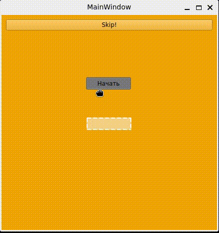
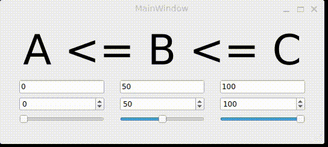
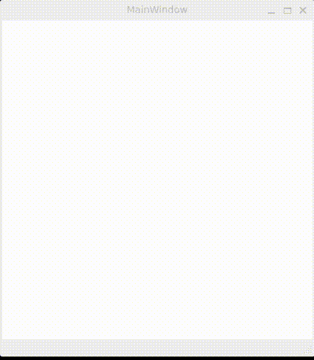
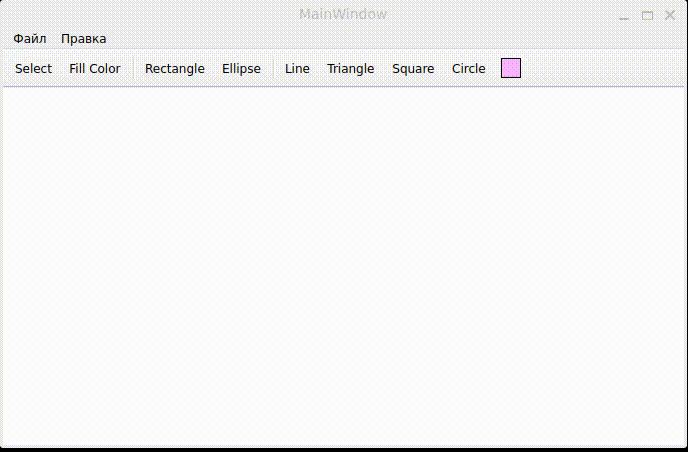

# 🧪 Дисциплина «Объектно-ориентированное программирование» (ООП)

[](https://github.com/codedarlie/oop-discipline)
[](https://www.qt.io/)
[](https://isocpp.org/)

> Репозиторий с лабораторными работами по курсу ООП.  
> Каждая работа — это отдельное приложение, демонстрирующее различные концепции: от классических матриц до графического редактора.

## 🗂️ Демонстрация работы

<div align="center">

| Проект | Демонстрация |
|:------:|:------------:|
| **Challenge Road** |  |
| **MVC** |  |
| **Circle Canvas** |  |
| **Shape Editor** |  |

</div>

> Все gif-файлы и скриншоты хранятся в папке [`/media`](media).

## 📁 Структура репозитория

```
oop-discipline/
├── challenge-road/         # Интерактивный квест с испытаниями
├── circle-canvas/          # Редактор кругов (клик-,ресайз-тест)
├── matrix-hierarchy/       # Иерархия классов для работы с матрицами
├── mvc/                    # Приложение на MVC (A ≤ B ≤ C)
├── shape-editor/           # Редактор графических фигур
├── media/                  # GIF-демонстрации
└── .gitignore
```

---

## 🎮 Лабораторные работы

### 1. Challenge Road — интерактивный квест
*Папка: `/challenge-road`*

Набор заданий, объединённых в квест: перетаскивание кнопки, ввод данных, работа с датой/временем, системы счисления, клик-тест, набор текста на скорость, изменение размера окна.

<details>
<summary><b>✨ Подробнее о заданиях</b></summary>

| Этап | Задание |
|------|---------|
| 0 | Перетащить кнопку в зону сброса |
| 1 | Заполнить профиль (имя, возраст, пол) |
| 2 | Выбрать текущие дату/время |
| 3 | Перевести DEC→BIN и DEC→OCT |
| 4 | Кликнуть правой кнопкой по области |
| 5 | Повторить случайный текст за 30 секунд |
| 6 | Изменить размер окна до целевых значений |
| 7 | Финиш |

</details>

---

### 2. Circle Canvas — редактор кругов
*Папка: `/circle-canvas`*

Приложение для создания и управления кругами. Демонстрирует работу с графикой (`QPainter`), событиями мыши/клавиатуры и шаблонным контейнером.

**Возможности:**
- 🖱️ Левая кнопка — создать круг
- 🔴 Клик по кругу — выделить (красный)
- 🔵 Наведение курсора — подсветка (синий)
- 🧹 `Delete` — удалить выделенные круги
- ➕ `Ctrl + клик` — множественное выделение

---

### 3. Matrix Hierarchy — иерархия матриц
*Папка: `/matrix-hierarchy``*

Полноценная ООП-иерархия: базовый класс `Matrix` и производный `SquareMatrix`.

<details>
<summary><b>📐 Демонстрируемые концепции</b></summary>

- Шесть видов конструкторов (включая копирования/перемещения)
- Перегрузка операторов (на примере `operator<<`)
- Виртуальные методы (`transpose`, `resize`)
- Правило "трёх" (деструктор, копирование, присваивание)
- Шаблонный класс `MatrixCalculator`
- Класс-обёртка `MatrixWrapper`

</details>

---

### 4. MVC — Model-View-Controller
*Папка: `/mvc`*

Приложение, реализующее паттерн [MVC](https://wikipedia.org/wiki/Model%E2%80%93view%E2%80%93controller). Поддерживает правило `A ≤ B ≤ C`. Данные синхронизируются между тремя типами виджетов: `QLineEdit`, `QSpinBox`, `QSlider`.

**Что показывает:**
- 📊 Чёткое разделение ответственности
- 🔄 Синхронизация данных через сигналы/слоты
- 💾 Сохранение состояния через `QSettings`
- ✅ Валидацию ввода и защиту от рекурсии

---

### 5. Shape Editor — графический редактор
*Папка: `/shape-editor`*

Графический редактор фигур.

<details>
<summary><b>✏️ Функциональность</b></summary>

**Поддерживаемые фигуры:**
- ➖ Линия
- 📐 Прямоугольник
- 🟦 Квадрат
- 🟢 Круг
- 🟡 Эллипс
- 🔺 Треугольник

**Действия:**
- Выделение (одиночное/множественное через `Ctrl`)
- Перемещение
- Изменение размера (8 хендлов)
- Заливка цветом
- Групповые операции: выделить всё/по типу, удалить

</details>

---

Ты абсолютно прав! Нужно учесть и консольное приложение (`matrix-hierarchy`), и установку зависимостей для WSL/Linux. Вот исправленный раздел:

---

## 🚀 Сборка и запуск

### 📦 Установка зависимостей (Linux / WSL)

```bash
# Qt 6 (для графических проектов)
sudo apt update
sudo apt install qt6-base-dev qt6-tools-dev qt6-network-dev qt6-sql-dev

# Компилятор и утилиты
sudo apt install build-essential make g++

# Дополнительные библиотеки (при необходимости)
sudo apt install libgl1-mesa-dev libglu1-mesa-dev
```
---

### 🖥️ Графические проекты `challenge-road`, `circle-canvas`, `mvc`, `shape-editor`

**Способ 1 — Qt Creator (рекомендуется):**
1. Открыть файл `.pro` в Qt Creator
2. Нажать **Build → Run** (`Ctrl+R`)

**Способ 2 — командная строка:**
```bash
cd <папка_проекта>   # например, cd shape-editor
qmake6               # или просто qmake
make
./<название_программы>
```

---

### ⌨️ Консольный проект (`matrix-hierarchy`)

**Сборка и запуск:**
```bash
cd matrix-hierarchy
g++ -std=c++17 main.cpp -o matrix-hierarchy
./matrix-hierarchy
```

**Или с Makefile (если есть):**
```bash
cd matrix-hierarchy
make
./matrix-hierarchy
```

---


### ⚡ Быстрая сборка всех проектов (Linux/WSL)

```bash
# Установка зависимостей (один раз)
sudo apt install qt6-base-dev build-essential

# Сборка графических проектов
for proj in challenge-road circle-canvas mvc shape-editor; do
    cd $proj
    qmake6 && make
    cd ..
done

# Сборка консольного проекта
cd matrix-hierarchy
g++ -std=c++17 main.cpp -o matrix-hierarchy
cd ..
```

---

### 🐛 Возможные проблемы и решения

| Проблема | Решение |
|----------|---------|
| `qmake6: command not found` | Установите `qt6-base-dev` или используйте `qmake` |
| `cannot find -lGL` | `sudo apt install libgl1-mesa-dev` |
| Графическое окно не открывается в WSL | Убедитесь, что установлен WSLg, или запустите через `export DISPLAY=:0` |
| `Qt_6 not found` | Установите точную версию: `sudo apt install qt6-base-dev` |
